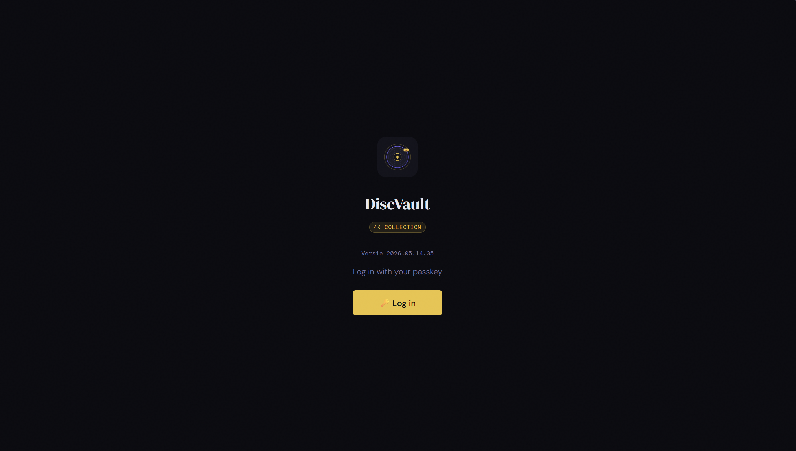
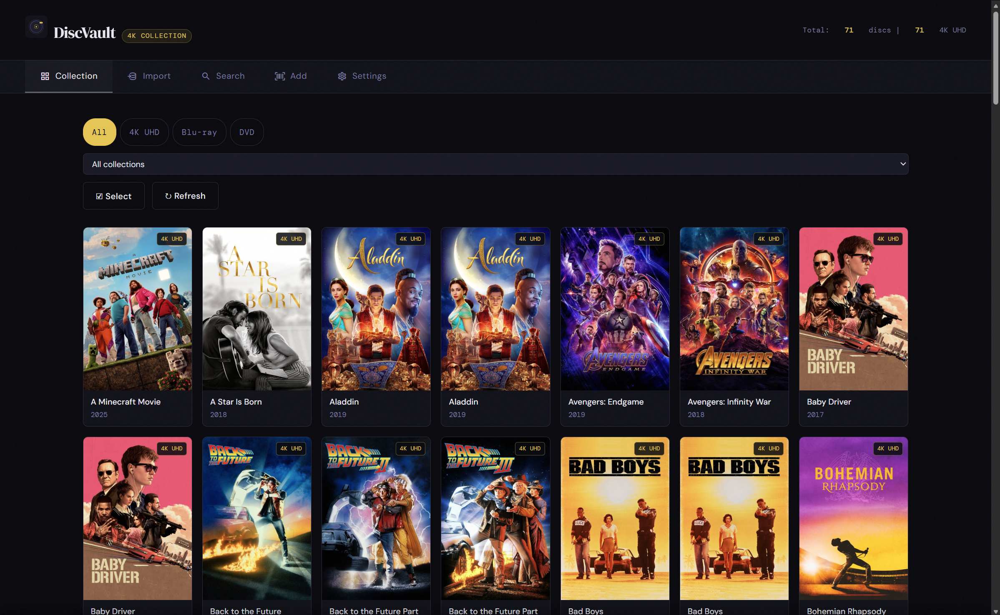
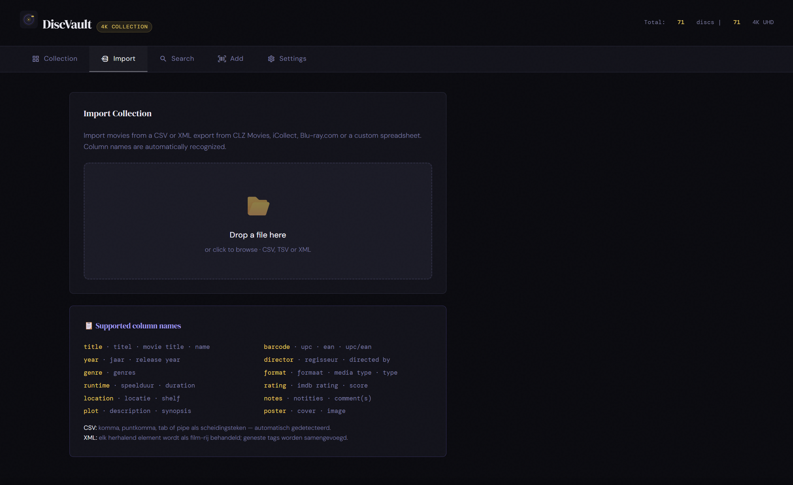
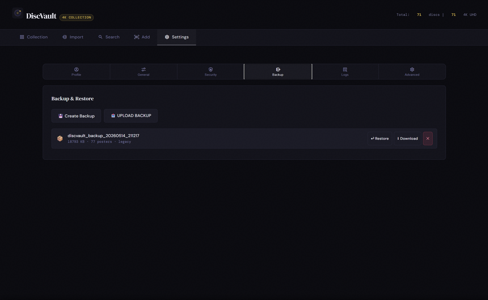
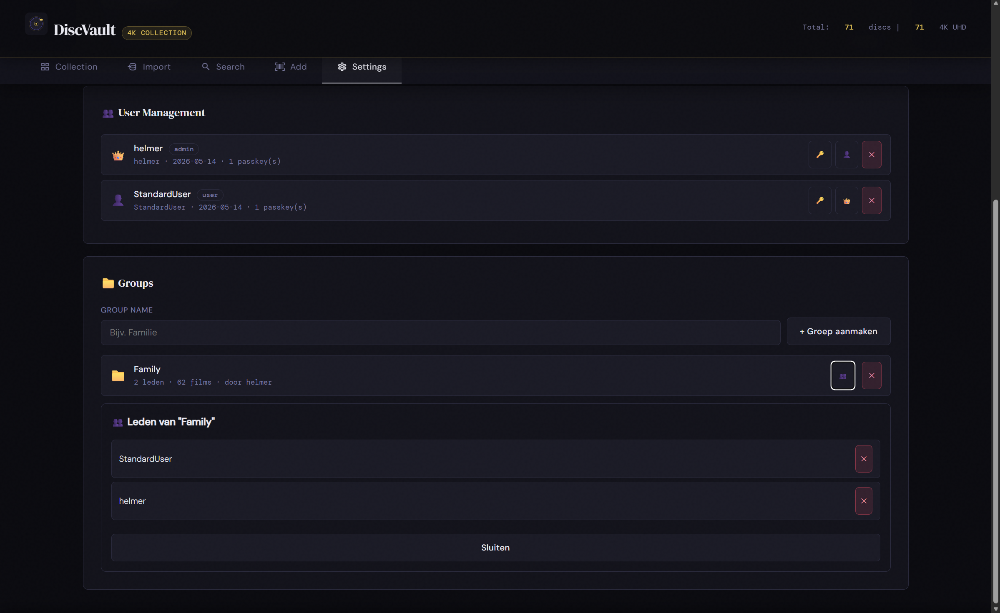
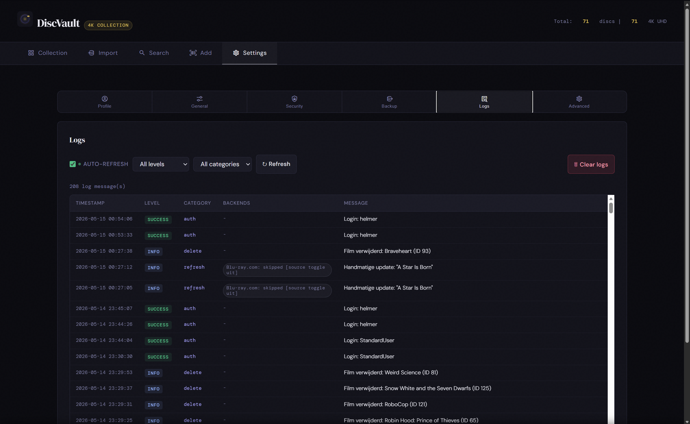
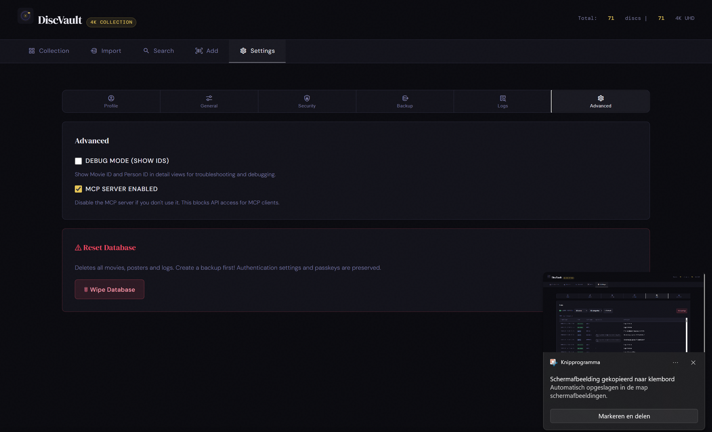
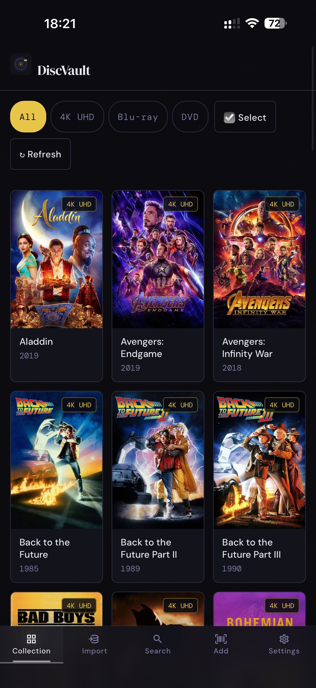

# DiscVault

DiscVault is a self-hosted physical media collection manager for 4K UHD, Blu-ray, and DVD.

DiscVault 26 is the next-generation app experience. It is available as a beta
today and will become the production channel when promoted to stable.

It includes:
- DiscVault 26 library with poster, list, and detail views
- Rich movie, container, box-set, poster, backdrop, video, and metadata pages
- PostgreSQL-backed v26 foundation with a guided migration path
- Plugin runtime for metadata, import sources, receivers, digital sources, API, and MCP
- Plex/Jellyfin digital media matching and MovieVault metadata integration
- Barcode scanning and manual entry
- Metadata lookup through configurable plugins
- Collection filtering, search, and format-aware browsing
- Backup and restore tools
- User management, groups, owner/admin tooling, and RBAC
- MemberGroups — user-created collaboration groups with invite system
- Watchlist & watch history
- Passkey authentication and recovery
- Invite-only registration — admin issues one-time passwords, open sign-up can be disabled
- Multilingual UI
- URL routing and deep links — share direct links to movies or views
- MCP endpoint integration for AI workflows
- PWA — works offline after adding to homescreen
- Push notifications — group members are notified when a new disc is added to a shared group
- User-scoped MCP access — personal API keys connect your AI assistant to your own collection only

## Live Website

- https://discvault.eu

## Docker Images

```
ghcr.io/helmerznl/discvault:latest   # production / stable
ghcr.io/helmerznl/discvault:beta     # DiscVault 26 beta
```

> Docker image references are lowercase. GitHub may show the repository name as
> `helmerzNL/DiscVault`, but Docker pulls should use
> `ghcr.io/helmerznl/discvault`.

## Unraid

- Unraid template repo: https://github.com/helmerzNL/unraid-templates
- Support thread: https://forums.unraid.net/topic/198808-support-discvault-physical-disc-collection-manager/

## Screenshots

### DiscVault 26 desktop preview

| | |
|---|---|
|  |  |
| Library posters | Library list |
|  |  |
| Rich detail page | Backdrops |
|  |  |
| Watchlist detail | Watched history |
|  |  |
| RBAC admin | Plugin admin |
|  |  |
| Operations | Preferences |

### Migration to DiscVault 26

DiscVault 26 includes a guided migration flow for existing installations. The
wizard checks your current data, confirms what can be imported, runs the
migration, and then opens the new DiscVault 26 app.

| | |
|---|---|
|  |  |
| Start migration | Authenticate with current passkey |
|  |  |
| Review migration wizard | Confirm migration scope |
|  |  |
| Ready to start | Migration in progress |
|  |  |
| Migration finished | Start DiscVault 26 |

### Current stable desktop

| | | |
|---|---|---|
|  |  |  |
| Sign in | Collection | Import |
|  |  |  |
| Backup & Restore | User Management | Logfiles |
|  | | |
| Advanced & MCP | | |

### Mobile

| | | | |
|---|---|---|---|
|  |  |  |  |
| Sign in | Search | Add movie | Profile |
|  |  |  |  |
| Metadata | Authentication | User management | Backup & Restore |
|  |  |  | |
| Logfiles | Advanced | Collection | |

## Install DiscVault 26 Beta

Use the beta channel to try DiscVault 26 while it is still being finalized.
Create a backup before moving an existing library between stable and beta.

```bash
docker run -d \
  --name discvault \
  -p 6080:80 \
  -p 6090:6090 \
  -e TZ=Europe/Amsterdam \
  -e RP_ID=localhost \
  -e RP_ORIGIN=http://localhost:6080 \
  -v /mnt/user/appdata/discvault:/data \
  ghcr.io/helmerznl/discvault:beta
```

Open: `http://localhost:6080`

For a reverse-proxy production-like beta host, set passkey values to the public
hostname:

```text
RP_ID=discvault.example.com
RP_ORIGIN=https://discvault.example.com
```

## Install DiscVault 26 Production / Stable

Use the production channel for stable deployments. When DiscVault 26 is promoted
from beta to production, this is the channel to run.

```bash
docker run -d \
  --name discvault \
  -p 6080:80 \
  -p 6090:6090 \
  -e TZ=Europe/Amsterdam \
  -e RP_ID=localhost \
  -e RP_ORIGIN=http://localhost:6080 \
  -v /mnt/user/appdata/discvault:/data \
  ghcr.io/helmerznl/discvault:latest
```

Open: `http://localhost:6080`

Before updating production:

- Create a backup from the admin tools or copy the persistent data directory while the container is stopped.
- Keep the same `/data` volume mapping so posters, backdrops, uploads, users, passkeys, and settings remain available.
- Review release notes before moving between beta and production channels.

## Install the standalone MovieVault v2 plugin

DiscVault `26.4.44` and newer provide the local anonymous synchronization
bridge used by the separately released `movievault_v2` plugin. Download the
plugin ZIP and checksum from
[helmerzNL/DiscVault-Plugins](https://github.com/helmerzNL/DiscVault-Plugins),
verify the SHA-256 checksum, and extract its `movievault_v2/` root folder into
`DISCVAULT_PLUGIN_INSTALL_DIR` (normally `/data/plugins` in the persistent
volume).

Restart DiscVault or refresh its plugin registry. The plugin supplies the
standard `https://movies2.vaultstack.eu` origin and safe operational defaults
while remaining disabled. Review or override those settings, then enable the
plugin; DiscVault queues the first synchronization automatically. Normal barcode,
title, release, and box-set queries then use the derived PostgreSQL index. The
existing `movievault_26` plugin remains independently available for MovieVault
Next. Its attributed contribution connection is not used for MovieVault v2
anonymous reads.

## Repository Structure

- `app/` - Main application code (backend, frontend, mcp-server, deployment files)
- `.github/workflows/` - CI/CD workflows

The marketing website (https://discvault.eu) lives in its own repository:
[helmerzNL/DiscVault.EU](https://github.com/helmerzNL/DiscVault.EU).

## License

MIT
