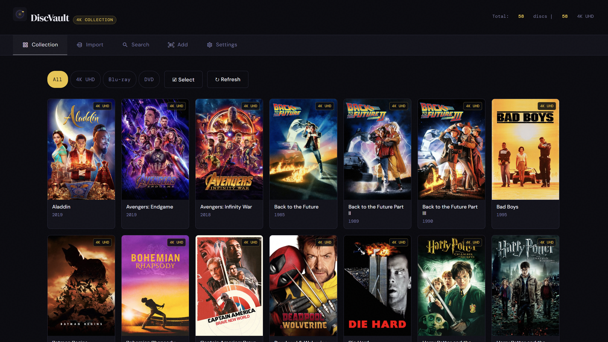
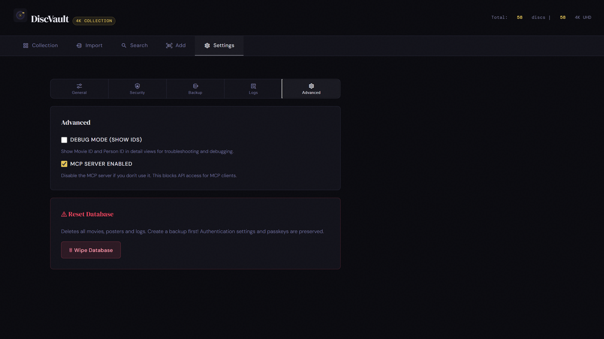
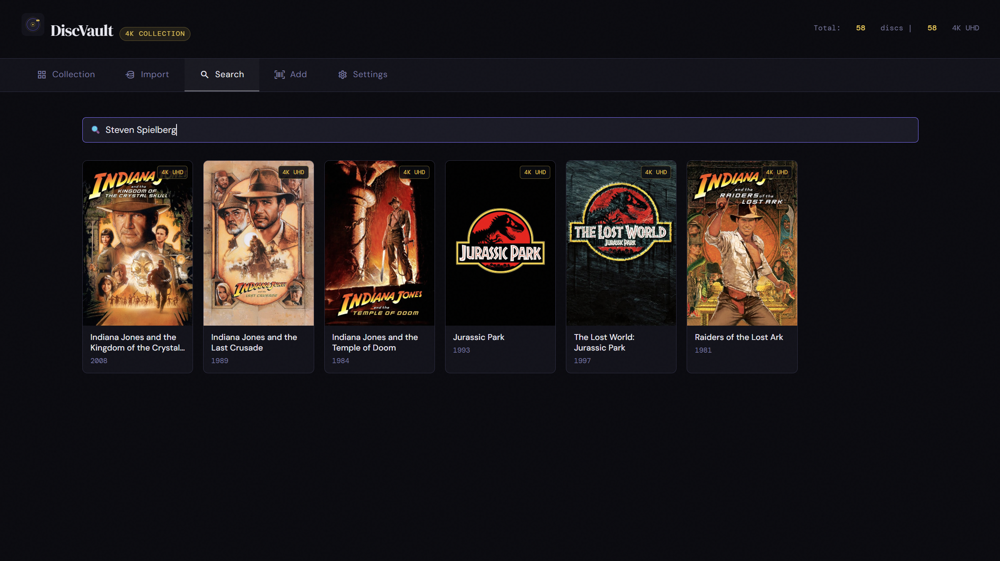

# DiscVault

DiscVault is a self-hosted physical media collection manager for 4K UHD, Blu-ray, and DVD.

It includes:
- Barcode scanning and manual entry
- Metadata lookup (OMDb + TMDb fallback)
- Collection filtering and search
- Backup and restore tools
- MCP endpoint integration for AI workflows

## Live Website

- https://discvault.nl

## Docker Image

- `ghcr.io/helmerzNL/DiscVault:latest`

## Unraid

- Unraid template repo: https://github.com/helmerzNL/unraid-templates
- Support thread: https://forums.unraid.net/topic/198808-support-discvault-physical-disc-collection-manager/

## Screenshots

### Sign-in


### Collection



### Scanner


### Settings + MCP Server



### Search



## Quick Start (Docker)

```bash
docker run -d \
  --name discvault \
  -p 6080:80 \
  -p 6090:6090 \
  -e TZ=Europe/Amsterdam \
  -e RP_ID=localhost \
  -e RP_ORIGIN=http://localhost:6080 \
  -v /mnt/user/appdata/discvault:/data \
  ghcr.io/helmerzNL/DiscVault:latest
```

Open: `http://localhost:6080`

## Repository Structure

- `app/` - Main application code (backend, frontend, mcp-server, deployment files)
- `website/` - GitHub Pages marketing site
- `.github/workflows/` - CI/CD workflows

## License

MIT
